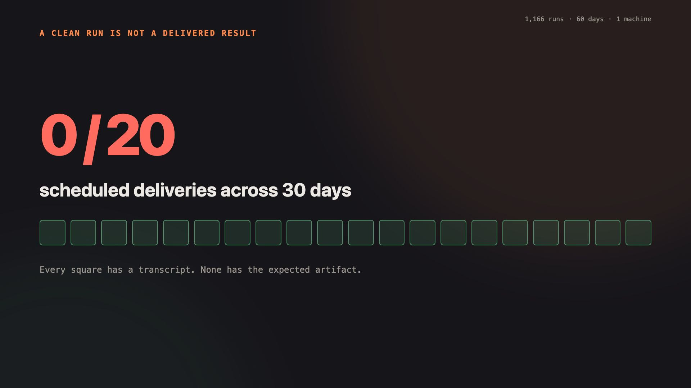
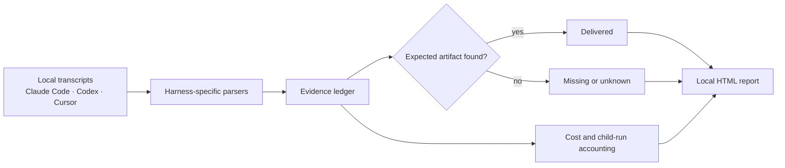
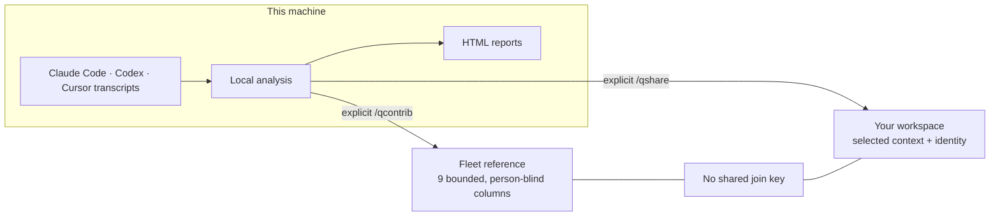

# session-viz

**Delivery assurance for Claude Code, Codex and Cursor.**

Your coding agents said they finished. session-viz checks what actually shipped, what silently
failed and what the run cost — without building a performance leaderboard for developers. It reads
the transcripts already on your machine and turns them into a local, evidence-backed report.

[See the measured findings](https://session-viz.com/#what) ·
[How verification works](https://session-viz.com/#features) ·
[Privacy architecture](https://session-viz.com/#planes)

## See the delivery audit

[](docs/media/delivery-audit-hero.mp4)

[Watch the narrated 45-second delivery audit](docs/media/delivery-audit-hero.mp4) — captions are
burned in, so it also works muted. The narration is AI-generated; music is “Close Up” by Michael
Ramir C. under the [Mixkit Stock Music Free License](https://mixkit.co/license/#musicFree).

## Audit recent runs

For Claude Code, the shortest path is:

```bash
claude plugin marketplace add QSchlegel/session-viz
claude plugin install session-viz@session-viz
```

Restart Claude Code, then run:

```text
/qruns
```

That first audit answers the operational questions vendor usage dashboards do not:

- Which scheduled runs and subagents delivered the file, commit or output they promised?
- Which jobs stayed green while repeatedly shipping nothing?
- Where did the tokens go, including cache-read and invisible child runs?
- Which failure belongs to an editable agent definition rather than to a person?

## How delivery verification works



Transcript completion and artifact delivery remain separate facts. session-viz checks the requested
file, commit or report where the evidence permits it; when the evidence does not support a delivery
claim, the ledger says missing or unknown instead of guessing.

## Measured proof, with the denominator attached

On one developer's machine over 60 days, session-viz found a scheduled job that ran 20 times and
delivered nothing, 95.7% of tokens spent on cache-read, and 1,102 subagent runs that ordinary
session views did not surface. Those are findings from one 1,166-run corpus, not universal
benchmarks. The report prints what it cannot conclude as carefully as what it can.

## Local first, explicit when anything leaves

Six commands send nothing anywhere: they read local transcripts, compute locally and open an HTML
report. The other five need a workspace, and two can deliberately put something about your work on
a wire. They are not the same kind of send:

- `/qcontrib` feeds the cross-tenant reference in nine bounded columns — no prompts, paths, repo
  names or timestamps finer than an ISO week. Person-blind by construction.
- `/qshare` publishes one project, session or run to **your own workspace** for colleagues to read.
  That payload can carry verbatim prompt text on purpose, and it names you.

`/qsetup` moves a credential and nothing else; `/qfeed` files task titles and briefs you have read
first; `/qteam` connects the shared workspace. The hosted side is optional, and all six local
analyses work with no account, token or network.



The two outbound paths are deliberately different. Fleet evidence cannot be joined back to a
person; collaboration keeps identity because teammates need to know who shared the selected work.

**It reads three harnesses and installs into three.** Reading is automatic; installing is
per-harness. A Claude Code install still analyses your Codex and Cursor history because those
transcripts are on the same disk.

| harness | read from | install into |
|---|---|---|
| Claude Code | `~/.claude/projects` | `claude plugin install` |
| Codex | `~/.codex/sessions` | `install.mjs codex` |
| Cursor | one SQLite database under `globalStorage` | `install.mjs cursor` |
| Claude Code **cloud** | not stored locally — see below | — |

## Install

### Claude Code

```bash
claude plugin marketplace add QSchlegel/session-viz
claude plugin install session-viz@session-viz
```

Two steps on purpose: `install` cannot resolve a plugin from a marketplace this machine has never
added.

The plugin cache is keyed by version, so an update does not replace anything: the new version
lands in its own directory and a harness already running keeps executing the old one, indefinitely
and without complaint. That matters because these commands report different numbers between
versions — not unstable numbers, better readings of the same corpus. `/qruns` carries the version
that produced its ledger as a field, and prints a warning above the figures when a newer version is
installed on this machine and is not what ran; restart the harness and the newer copy is picked up.
That check is a directory listing under the cache, never a request — it reports what you already
installed, never what the marketplace has. The other commands do not carry the stamp yet.

### Codex, Cursor

Both read the same skill format Claude Code does — a directory holding a `SKILL.md` with `name`
and `description` frontmatter — so all eleven commands work there. What is *not* portable is the
line inside each one that runs the analysis: it says `${CLAUDE_PLUGIN_ROOT}`, a variable only
Claude Code sets, which anywhere else expands to nothing and fails on a path that never existed.

So this resolves it on the way in, rather than asking you to:

```bash
git clone https://github.com/QSchlegel/session-viz
cd session-viz && npm install && npm run build
node plugins/session-viz/scripts/install.mjs
```

With no arguments it installs into whichever harnesses are on the machine. Name them to be explicit
— `install.mjs codex cursor` — or pass `--dry-run` to see what it would write first.

```bash
node plugins/session-viz/scripts/install.mjs --list        # what is installed, and is it current
node plugins/session-viz/scripts/install.mjs --uninstall codex
```

The skills are copied; the scripts are not. Copies point back at the checkout, so **re-run install
after updating the plugin** — `--list` reports when a copy has gone stale. `--uninstall` removes
only files this tool wrote, identified by a marker inside them, so a skill of the same name you
wrote by hand is never touched.

Restart the harness afterwards: skills register at startup.

One behavioural difference is worth knowing rather than discovering. Claude Code honours
`disable-model-invocation`, so these run only when you ask for them. Codex and Cursor have no
equivalent, so the model there may decide to run them itself. They are read-only analyses — but
read-only is not the same as expected.

### Cloud sessions

Claude Code sessions run on claude.ai/code keep their transcripts server-side. They are not under
`~/.claude`, not in the desktop app's support directory, and `claude agents --json` lists only
local runs — so nothing here can read them unless you attach the session from this machine, which
writes a local transcript like any other. Every report says so, rather than quietly leaving the
surface out of the numbers.

## Commands

| | |
|---|---|
| `/qpact` | This session: score, friction, and a `/compact` line worth running |
| `/qtrends` | Every session: gated trends across repos and model releases |
| `/qruns` | Subagent and cron runs — the delivery ledger nothing else reads |
| `/qcost` | Where the tokens actually went |
| `/qship` | Prompts you keep retyping, split into rituals and misses |
| `/qdoctor` | This repo's config, measured against your other repos |
| `/qsetup` | Connect this machine — sign in in the browser, no token typed or pasted |
| `/qshare` | Choose what your team can see — nothing by default |
| `/qfeed` | File tasks from findings that passed a gate — and only those |
| `/qteam` | Shared vaults and task handoff (needs the hosted side) |
| `/qcontrib` | Contribute the delivery ledger as nine bounded columns — run it bare to see what would leave, and what stays |

## What it refuses to tell you

The design constraint that shapes everything: **it measures artifacts, not people.**

Not because that is a nicer thing to say, but because the numbers do not support the alternative.
Prompt-form signals are confounded with task difficulty — hard tasks get longer prompts and worse
outcomes, so "long prompts are bad" falls out of the arithmetic and means nothing. Every signal is
stratified by workload and put through a two-proportion z-test before it is shown, and most do not
survive. The ones that fail say so rather than quietly appearing anyway.

The same applies to model comparisons: releases are confounded with time, and where there are no
overlapping weeks the comparison is refused rather than estimated.

## Requirements

Node 18+ for Claude Code and Codex. **Node 22+ to read Cursor**, which keeps its history in SQLite and
is reached through `node:sqlite` — built in from 22, and absent before it.

Below 22 nothing breaks and nothing is silently missing: Cursor is reported in the coverage block of
every report as present-but-unreadable, with the reason. That is a different sentence from "you do not
use Cursor", and the two should never look the same.

No runtime dependencies at any version.

## Building

Sources are TypeScript in `plugins/session-viz/src/*.mts`, compiled to
`plugins/session-viz/scripts/*.mjs`. The compiled output is committed, because a plugin
is installed by cloning it — there is no build step on the machine that installs it.

```bash
npm install
npm run build     # src/*.mts -> scripts/*.mjs
npm run check     # types only, no emit
```

Edit the `.mts` sources, never `scripts/`. Each compiled script is runnable directly:

```bash
node plugins/session-viz/scripts/runs.mjs --help
```

## The hosted side

[QSchlegel/session-viz-cloud](https://github.com/QSchlegel/session-viz-cloud) is the optional
backend: person-blind fleet telemetry on one plane, identity-bearing collaboration on another, and
the two structurally unable to join. Sign in at [session-viz.com](https://session-viz.com) if you
want it. Ignore it entirely and the plugin loses nothing.

## Licence

MIT — see [LICENSE](LICENSE).
